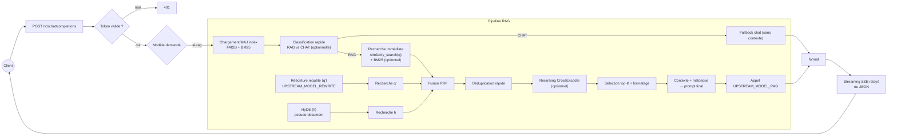

# OpenAI‑compatible RAG API

Un serveur **FastAPI** exposant une API **compatible OpenAI** (`/v1/chat/completions`) dédiée au **RAG conversationnel** (retrieval‑augmented generation) basé sur **FAISS** + **HuggingFace embeddings**.

> Fichier principal : `app.py` — Version API : **2.1.0**

---

## ✨ Fonctionnalités

* **Compatibilité OpenAI**: accepte les payloads `chat/completions` standards
* **Modèle logique unique** exposé : `ai-rag`
* **RAG conversationnel** avec stratégie **rewrite + HyDE** (configurable)
* **FAISS** persistant via `vectorstore_db/` (auto‑construction si `wiki.txt` est présent)
* **Réécriture de requête** et **HyDE** (configurables) pour améliorer le rappel documentaire
* **Recherche hybride FAISS + BM25** (activée par défaut, configurable)
* **Fusion RRF + déduplication + reranking** des chunks (optionnels)
* **Sources** renvoyées dans la réponse (suffixe « Sources: … »)
* **Streaming SSE** relayé depuis l’amont (chunks OpenAI)
* **Auth Bearer** optionnelle côté entrée, **clé OpenAI** côté sortie

---

## 🧠 Algorithme RAG (vue d’ensemble)

```text
[Messages] → (1) Réécriture → q'
             (2) HyDE (pseudo‑document) → h
             (3) Retrieval FAISS (similarity_search)
                 • q (immédiat)
                 • q' (si activé)
                 • h (si activé)
             (4) Fusion RRF + déduplication (+ reranking)
             (5) Contexte = concat top‑K (K=RAG_TOP_K)
             (6) Prompt vers modèle amont (UPSTREAM_MODEL_RAG)
             (7) Réponse + liste des sources
```

### Diagramme de flux



### Détails étape par étape

0. **Vectorstore** (`_ensure_vectorstore`) : charge `vectorstore_db/` (index FAISS + `chunks.pkl`), le reconstruit si absent, si `RAG_FORCE_REBUILD=on`, ou si les sources d’ingestion sont plus récentes.
1. **Historique court** : un extrait des 3 derniers messages précédents est construit pour la réécriture.
2. **Réécriture** (`_rewrite_query`) : le serveur appelle le LLM amont (param `UPSTREAM_MODEL_REWRITE`) pour produire une requête optimisée.
3. **HyDE** (`_hyde_expand`) : on génère un pseudo‑document court à partir de la requête utilisateur.
4. **Classification (optionnelle)** : un filtre rapide **RAG vs CHAT** peut forcer un fallback sans contexte si activé (`ENABLE_QUERY_CLASSIFICATION=true`).
5. **Retrieval** (`_retrieve_pipeline`) :

   * **Recherche immédiate** sur la requête utilisateur.
   * **Recherche secondaire** sur la requête réécrite (si activée).
   * **Recherche HyDE** sur le pseudo‑document (si activée).
   * **Hybrid BM25** optionnel en complément.
6. **Fusion & déduplication** : fusion RRF, déduplication (hash + fuzzy match), reranking optionnel.
7. **Contexte** : concaténation des `RAG_TOP_K` premiers chunks.
8. **Génération** : on envoie au modèle amont un prompt système + le **contexte** + l’historique récent.
9. **Sources** : noms de fichiers (métadonnée `source`) déduits des chunks retenus.

> ⚠️ Si aucun chunk pertinent : réponse courte indiquant l’insuffisance du contexte.

---

## 🏗️ Architecture interne

* **FastAPI** + **CORSMiddleware**
* **/v1/chat/completions** : route unique côté client
* **RAG** : construit un prompt enrichi par le contexte, puis appelle `UPSTREAM_MODEL_RAG`
* **FAISS** : persistance sur disque ; re‑binding de la fonction d’embedding au chargement
* **Embeddings** : `BAAI/bge-m3` (HuggingFace)
* **Rebuild conditionnel** : recharge `vectorstore_db/` ou le régénère si `wiki.txt` est plus récent ou si `RAG_FORCE_REBUILD` est activé

---

## 🔧 Variables d’environnement

| Variable | Défaut | Description |
| --- | --- | --- |
| `OPENAI_API_BASE` | `http://localhost:8000/v1` | Endpoint OpenAI‑compatible en amont. |
| `OPENAI_API_KEY` | `changeme` | Clé API pour l’amont. |
| `API_AUTH_TOKEN` | *(vide)* | Si défini : **obligatoire** en entrée via `Authorization: Bearer …`. |
| `UPSTREAM_MODEL_RAG` | `gpt-4o-mini` | Modèle amont pour la génération RAG. |
| `UPSTREAM_MODEL_REWRITE` | `=UPSTREAM_MODEL_RAG` | Modèle amont pour la réécriture et HyDE. |
| `MODEL_RAG` | `ai-rag` | Nom logique exposé pour le pipeline RAG. |
| `VECTORSTORE_DIR` | `vectorstore_db` | Dossier du FAISS sérialisé (persisté sur disque). |
| `WIKI_TXT` | `wiki.txt` | Corpus brut utilisé pour construire le FAISS si absent. |
| `INGESTION_SOURCES` | `text` | Sources d’ingestion activées (`text`, `thunderbird`, ou liste séparée par des virgules). |
| `INGESTION_TEXT_PATHS` | *(vide)* | Liste de fichiers ou dossiers `.txt` (séparés par virgule). Si vide, utilise `WIKI_TXT`. |
| `THUNDERBIRD_PROFILE_DIR` | *(vide)* | Chemin du profil Thunderbird local (Windows : `%APPDATA%\\Thunderbird\\Profiles\\<profil>`). |
| `THUNDERBIRD_MAX_MESSAGES` | `10000` | Limite max de messages ingérés depuis Thunderbird. |
| `INGESTION_REFRESH_INTERVAL` | `0` | Intervalle (secondes) pour rebalayer les sources et reconstruire l’index si besoin. |
| `RAG_FORCE_REBUILD` | `true` | Si `1/true/on` : force la reconstruction du FAISS au démarrage. |
| `RAG_TOP_K` | `8` | Nombre max de chunks concaténés dans le contexte. |
| `RAG_QUERY_STRATEGY` | `rewrite+hyde` | `simple`, `rewrite`, `hyde` ou `rewrite+hyde`. |
| `RAG_HISTORY_WINDOW` | `6` | Nb. de messages conservés pour le prompt final. |
| `ENABLE_HYBRID_SEARCH` | `true` | Active la recherche BM25 hybride. |
| `ENABLE_RERANKING` | `true` | Active le reranking CrossEncoder. |
| `ENABLE_QUERY_CLASSIFICATION` | `true` | Active la classification rapide RAG vs CHAT. |
| `EMBEDDING_MODEL` | `BAAI/bge-m3` | Modèle d’embeddings utilisé. |
| `BM25_K` | `4` | Nombre de résultats BM25 pris en compte. |
| `PORT` | `8080` | Port HTTP local. |

---

## 🚀 Démarrage rapide

### Prérequis

* Python 3.10+
* `pip` (ou `uv`, `poetry` au choix)

### Installation

```bash
python -m venv .venv && source .venv/bin/activate
pip install -U pip
pip install fastapi uvicorn[standard] requests langchain-community langchain-huggingface langchain-text-splitters faiss-cpu pydantic
# ou, pour rester aligné avec ce dépôt :
pip install -r requirements.txt
```

> **FAISS** : selon l’OS, vous pouvez préférer `faiss-gpu`.

### Données

* Par défaut, placez vos contenus dans `wiki.txt` (texte brut). Au premier démarrage sans `vectorstore_db/`, l’index sera construit et persisté.
* Pour plusieurs fichiers/dossiers texte : utilisez `INGESTION_TEXT_PATHS="/chemin/a.txt,/chemin/vers/dossier"` et `INGESTION_SOURCES=text`.
* Pour ingérer des mails Thunderbird locaux : définissez `INGESTION_SOURCES=text,thunderbird` et `THUNDERBIRD_PROFILE_DIR` vers le dossier de profil.
* Pour ajouter régulièrement les nouveaux mails : définissez `INGESTION_REFRESH_INTERVAL=300` (ex. toutes les 5 minutes).

### Lancer le serveur

```bash
export OPENAI_API_BASE="https://api.openai.com/v1"           # ou votre passerelle vLLM
export OPENAI_API_KEY="sk-..."
export API_AUTH_TOKEN="my-inbound-token"
uvicorn app:app --host 0.0.0.0 --port 8080
```

### Lancer via `run.sh` (avec `.env`)

Le script `run.sh` crée un venv dédié, installe les dépendances et lance `uvicorn`. Il **nécessite** un fichier `.env` à la racine avec les variables d’environnement (au minimum `OPENAI_API_BASE` et `OPENAI_API_KEY`).

```bash
# Exemple minimal .env
OPENAI_API_BASE="https://api.openai.com/v1"
OPENAI_API_KEY="sk-..."
API_AUTH_TOKEN="my-inbound-token"
```

Puis démarrez avec :

```bash
./run.sh 0.0.0.0 8080
```

---

## 🧪 Appels API (exemples)

### 1) RAG (`MODEL_RAG`)

```bash
curl -s http://localhost:8080/v1/chat/completions \
  -H "Authorization: Bearer my-inbound-token" \
  -H "Content-Type: application/json" \
  -d '{
    "model": "ai-rag",
    "messages": [
      {"role": "user", "content": "Résume les points clés du document sur la migration Kubernetes."}
    ]
  }'
```

### 2) Streaming (SSE relayé côté serveur)

```bash
curl -N http://localhost:8080/v1/chat/completions \
  -H "Authorization: Bearer my-inbound-token" \
  -H "Content-Type: application/json" \
  -d '{
    "model": "ai-rag",
    "stream": true,
    "messages": [
      {"role": "user", "content": "Donne une synthèse en 6 lignes."}
    ]
  }'
```

> En mode `stream: true`, le serveur relaie le flux SSE de l’amont.

---

## ✅ Évaluer la qualité du RAG

Ce dépôt fournit un script léger pour mesurer la qualité du RAG **sans dépendances externes**. Le principe : envoyer une liste de questions, vérifier la présence des **sources** renvoyées par l’API, et mesurer si la réponse contient des **mots‑clés attendus**.

### 1) Préparer un dataset JSONL

Chaque ligne contient :
* `question` : la question utilisateur.
* `expected_sources` : liste de sources attendues (ex. `README.md`).
* `expected_keywords` : liste de mots‑clés attendus dans la réponse.
* `metadata` : optionnel.

Un exemple est fourni : `eval_dataset.sample.jsonl`.

### 2) Lancer l’évaluation

```bash
python evaluate_rag.py \
  --dataset eval_dataset.sample.jsonl \
  --endpoint http://localhost:8080/v1/chat/completions \
  --model ai-rag \
  --token my-inbound-token
```

Le script affiche un résumé JSON avec :
* `avg_precision` : précision des sources.
* `avg_recall` : rappel des sources.
* `avg_keyword_recall` : rappel des mots‑clés.

### 3) Exporter les résultats détaillés

```bash
python evaluate_rag.py \
  --dataset eval_dataset.sample.jsonl \
  --output eval_results.json
```

> 💡 Astuce : enrichissez le dataset avec vos documents réels (noms de fichiers attendus) pour une mesure fidèle.

---

## 🔐 Authentification

* **Entrée** : si `API_AUTH_TOKEN` est défini, chaque requête **doit** fournir `Authorization: Bearer <token>`.
* **Sortie** : `OPENAI_API_KEY` est utilisé côté serveur pour appeler le fournisseur amont.

---

## 🗃️ Indexation & embeddings

* Embeddings : `BAAI/bge-m3`
* Splitter : `RecursiveCharacterTextSplitter(chunk_size=800, overlap=100)`
* Persistant : `vectorstore_db/` (`index.faiss` + `chunks.pkl`)

---

## ⚙️ Paramétrage RAG

* **Stratégies** (`RAG_QUERY_STRATEGY`) :

  * `simple` : pas de réécriture ni HyDE
  * `rewrite` : réécriture seule
  * `hyde` : HyDE seul
  * `rewrite+hyde` : réécriture puis HyDE (par défaut)
* **Top‑K** : `RAG_TOP_K` (8 par défaut)
* **Fenêtre d’historique** : `RAG_HISTORY_WINDOW` (6 par défaut)

---

## 🧯 Dépannage

* **401 Missing Authorization** : définissez `API_AUTH_TOKEN` côté serveur et envoyez l’en‑tête Bearer côté client.
* **Vectorstore introuvable** : fournissez `wiki.txt` au premier lancement, ou placez un `vectorstore_db/` existant.
* **Performances embeddings** : selon l’OS/CPU, préférez `faiss-gpu` si GPU dispo.
* **Réponses « contexte insuffisant »** : augmentez `RAG_TOP_K`, améliorez `wiki.txt`, ou désactivez le reranking.

---

## 🔧 Conseils performance/qualité

* Nettoyez/structurez `wiki.txt` (titres, séparateurs) pour de meilleurs chunks
* Ajustez `chunk_size`/`overlap` si vos documents sont hétérogènes
* Re‑entraîner FAISS (reconstruire `vectorstore_db/`) après de gros changements de corpus
* Fixez `RAG_TOPIC_PREFIX` pour forcer un domaine (ex. « Kubernetes », « DSFR », etc.)

---

## 🧭 Roadmap (suggestions)

* Support **/v1/embeddings** pour publier les embeddings
* Ajout d’un **reranker** (ex. cross‑encoder) facultatif
* **Citations** positionnelles (lignes/offsets dans la source)
* **Batching** upstream pour réduire la latence

---

## 📄 Licence

À définir par le propriétaire du dépôt (ex. MIT, Apache‑2.0).

---

## 🙌 Crédits

* FAISS — Facebook AI Similarity Search
* HuggingFace Transformers & sentence‑transformers
* FastAPI

---

## Structure minimale du repo

```
.
├── app.py
├── wiki.txt                # optionnel, pour construire FAISS au premier run
├── vectorstore_db/         # généré automatiquement si absent et wiki.txt présent
└── README.md
```
