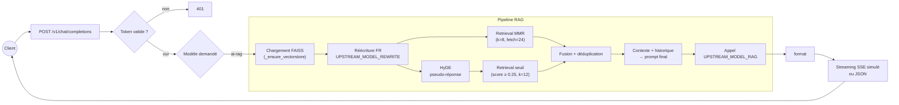

# OpenAI‑compatible RAG API

Un serveur **FastAPI** exposant une API **compatible OpenAI** (`/v1/chat/completions`) dédiée au **RAG conversationnel** (retrieval‑augmented generation) basé sur **FAISS** + **HuggingFace embeddings**.

> Fichier principal : `app.py` — Version API : **1.2.1**

---

## ✨ Fonctionnalités

* **Compatibilité OpenAI**: accepte les payloads `chat/completions` standards
* **Modèle logique unique** exposé : `ai-rag`
* **RAG conversationnel** avec stratégie **rewrite + HyDE** (configurable)
* **FAISS** persistant via `vectorstore.pkl` (auto‑construction si `wiki.txt` est présent)
* **Réécriture de requête** (FR) et **HyDE** pour améliorer le rappel documentaire
* **MMR + seuil de similarité** + **déduplication** des chunks
* **Sources** renvoyées dans la réponse (suffixe « Sources: … »)
* **Streaming SSE** simulé (chunks OpenAI) côté serveur
* **Auth Bearer** optionnelle côté entrée, **clé OpenAI** côté sortie
* **Patch auto du tokenizer `pad_token`** pour certains embeddings HuggingFace

---

## 🧠 Algorithme RAG (vue d’ensemble)

```text
[Messages] → (1) Réécriture FR (<=32 mots) → q
             (2) HyDE (réponse fictive courte) → pseudo
             (3) Retrieval FAISS
                 • MMR(k=8, fetch_k=24, λ=0.5) sur q
                 • Similarity threshold(score≥0.25, k=12) sur pseudo
             (4) Fusion + déduplication des chunks
             (5) Contexte = concat top‑K (K=RAG_TOP_K)
             (6) Prompt vers modèle amont (UPSTREAM_MODEL_RAG)
             (7) Réponse + liste des sources
```

### Diagramme de flux



### Détails étape par étape

0. **Vectorstore** (`_ensure_vectorstore`) : charge `vectorstore.pkl`, le reconstruit si absent, si `RAG_FORCE_REBUILD=on`, ou si `wiki.txt` est plus récent.
1. **Fenêtre d’historique** : un extrait de `HISTORY_WINDOW` derniers messages est construit.
2. **Réécriture** (`_rewrite_query`) : le serveur appelle le LLM amont (param `UPSTREAM_MODEL_REWRITE`) pour produire **une** requête FR autonome (≤ 32 mots), optionnellement préfixée par `RAG_TOPIC_PREFIX`.
3. **HyDE** (`_hyde_expand`) : on génère une **réponse idéale courte** (FR, ≤ 6 lignes) à partir de la requête réécrite, pour densifier la sémantique lors du retrieval.
4. **Retrieval** (`_retrieve_with_strategy`) :

   * **MMR** (k=8, fetch\_k=24, λ=0.5) sur la requête réécrite → diversité des chunks.
   * **Seuil** (score≥0.25, k=12) sur le texte HyDE → chunks très pertinents.
5. **Déduplication** : on conserve le premier chunk de chaque « signature » calculée sur les 256 premiers caractères.
6. **Contexte** : concaténation des `RAG_TOP_K` premiers chunks.
7. **Génération** : on envoie au modèle amont un prompt système prudent + le **contexte** + la **requête utilisateur initiale** (et non la réécriture). Le LLM doit **se limiter** au contexte, sinon indiquer que c’est insuffisant.
8. **Sources** : noms de fichiers (métadonnée `source`) déduits des chunks retenus.

> ⚠️ Si aucun chunk pertinent : réponse courte indiquant l’insuffisance du contexte.

---

## 🏗️ Architecture interne

* **FastAPI** + **CORSMiddleware**
* **/v1/chat/completions** : route unique côté client
* **RAG** : construit un prompt enrichi par le contexte, puis appelle `UPSTREAM_MODEL_RAG`
* **FAISS** : persistance sur disque ; re‑binding de la fonction d’embedding au chargement
* **Embeddings** : `OrdalieTech/Solon-embeddings-large-0.1` (HuggingFace)
* **Auto‑patch tokenizer** : ajoute `pad_token` si manquant (ex. XLMRobertaTokenizerFast)
* **Rebuild conditionnel** : recharge `vectorstore.pkl` ou le régénère si `wiki.txt` est plus récent ou si `RAG_FORCE_REBUILD` est activé

---

## 🔧 Variables d’environnement

| Variable | Défaut | Description |
| --- | --- | --- |
| `OPENAI_API_BASE` | `http://localhost:8000/v1` | Endpoint OpenAI‑compatible en amont. |
| `OPENAI_API_KEY` | `changeme` | Clé API pour l’amont. |
| `API_AUTH_TOKEN` | *(vide)* | Si défini : **obligatoire** en entrée via `Authorization: Bearer …`. |
| `UPSTREAM_MODEL_RAG` | `gpt-4o-mini` | Modèle amont pour la génération RAG. |
| `UPSTREAM_MODEL_REWRITE` | `=UPSTREAM_MODEL_RAG` | Modèle amont pour la réécriture et HyDE. |
| `MODEL_RAG` | `ai-rag` | Nom logique exposé pour le pipeline RAG. |
| `VECTORSTORE_PATH` | `vectorstore.pkl` | Chemin du FAISS sérialisé (persisté sur disque). |
| `WIKI_TXT` | `wiki.txt` | Corpus brut utilisé pour construire le FAISS si absent. |
| `RAG_FORCE_REBUILD` | *(vide)* | Si `1/true/on` : force la reconstruction du FAISS au démarrage. |
| `RAG_TOP_K` | `10` | Nombre max de chunks concaténés dans le contexte. |
| `RAG_QUERY_STRATEGY` | `rewrite+hyde` | `vanilla`, `rewrite`, `hyde` ou `rewrite+hyde`. |
| `RAG_HISTORY_WINDOW` | `6` | Nb. de messages conservés pour la réécriture. |
| `RAG_TOPIC_PREFIX` | *(vide)* | Préfixe thématique forcé (ex. « Kubernetes »). |
| `PORT` | `8080` | Port HTTP local. |

---

## 🚀 Démarrage rapide

### Prérequis

* Python 3.10+
* `pip` (ou `uv`, `poetry` au choix)

### Installation

```bash
python -m venv .venv && source .venv/bin/activate
pip install -U pip
pip install fastapi uvicorn[standard] requests langchain-community langchain-huggingface langchain-text-splitters faiss-cpu pydantic
# ou, pour rester aligné avec ce dépôt :
pip install -r requirements.txt
```

> **FAISS** : selon l’OS, vous pouvez préférer `faiss-gpu`.

### Données

* Placez vos contenus dans `wiki.txt` (texte brut). Au premier démarrage sans `vectorstore.pkl`, l’index sera construit et persisté.

### Lancer le serveur

```bash
export OPENAI_API_BASE="https://api.openai.com/v1"           # ou votre passerelle vLLM
export OPENAI_API_KEY="sk-..."
export API_AUTH_TOKEN="my-inbound-token"
uvicorn app:app --host 0.0.0.0 --port 8080
```

---

## 🧪 Appels API (exemples)

### 1) RAG (`MODEL_RAG`)

```bash
curl -s http://localhost:8080/v1/chat/completions \
  -H "Authorization: Bearer my-inbound-token" \
  -H "Content-Type: application/json" \
  -d '{
    "model": "ai-rag",
    "messages": [
      {"role": "user", "content": "Résume les points clés du document sur la migration Kubernetes."}
    ]
  }'
```

### 2) Streaming (SSE simulé côté serveur)

```bash
curl -N http://localhost:8080/v1/chat/completions \
  -H "Authorization: Bearer my-inbound-token" \
  -H "Content-Type: application/json" \
  -d '{
    "model": "ai-rag",
    "stream": true,
    "messages": [
      {"role": "user", "content": "Donne une synthèse en 6 lignes."}
    ]
  }'
```

> En mode `stream: true`, le serveur renvoie un flux SSE créé localement à partir de la réponse non‑stream de l’amont.

---

## 🔐 Authentification

* **Entrée** : si `API_AUTH_TOKEN` est défini, chaque requête **doit** fournir `Authorization: Bearer <token>`.
* **Sortie** : `OPENAI_API_KEY` est utilisé côté serveur pour appeler le fournisseur amont.

---

## 🗃️ Indexation & embeddings

* Embeddings : `OrdalieTech/Solon-embeddings-large-0.1`
* Splitter : `RecursiveCharacterTextSplitter(chunk_size=800, overlap=120)`
* Persistant : `vectorstore.pkl`
* **Patch tokenizer** : si le tokenizer n’a pas de `pad_token`, on utilise `eos` ou `sep` à défaut, sinon ajout `[PAD]` + `resize_token_embeddings` si possible.

---

## ⚙️ Paramétrage RAG

* **Stratégies** (`RAG_QUERY_STRATEGY`) :

  * `vanilla` : pas de réécriture ni HyDE
  * `rewrite` : réécriture seule
  * `hyde` : HyDE seul
  * `rewrite+hyde` : réécriture puis HyDE (par défaut)
* **Retrievers** :

  * `MMR`: `k=8`, `fetch_k=24`, `lambda_mult=0.5`
  * `similarity_score_threshold`: `score_threshold=0.25`, `k=12`
* **Top‑K** : `RAG_TOP_K` (10 par défaut)
* **Fenêtre d’historique** : `HISTORY_WINDOW` (6 par défaut)

---

## 🧯 Dépannage

* **401 Missing Authorization** : définissez `API_AUTH_TOKEN` côté serveur et envoyez l’en‑tête Bearer côté client.
* **Vectorstore introuvable** : fournissez `wiki.txt` au premier lancement, ou placez un `vectorstore.pkl` existant.
* **Performances embeddings** : selon l’OS/CPU, préférez `faiss-gpu` si GPU dispo.
* **Réponses « contexte insuffisant »** : augmentez `RAG_TOP_K`, améliorez `wiki.txt`, ou baissez `score_threshold`.
* **Problèmes tokenizer** : le patch auto s’exécute, mais vous pouvez changer de modèle d’embeddings si nécessaire.

---

## 🔧 Conseils performance/qualité

* Nettoyez/structurez `wiki.txt` (titres, séparateurs) pour de meilleurs chunks
* Ajustez `chunk_size`/`overlap` si vos documents sont hétérogènes
* Re‑entraîner FAISS (reconstruire `vectorstore.pkl`) après de gros changements de corpus
* Fixez `RAG_TOPIC_PREFIX` pour forcer un domaine (ex. « Kubernetes », « DSFR », etc.)

---

## 🧭 Roadmap (suggestions)

* Support **/v1/embeddings** pour publier les embeddings
* Ajout d’un **reranker** (ex. cross‑encoder) facultatif
* **Citations** positionnelles (lignes/offsets dans la source)
* **Batching** upstream pour réduire la latence

---

## 📄 Licence

À définir par le propriétaire du dépôt (ex. MIT, Apache‑2.0).

---

## 🙌 Crédits

* FAISS — Facebook AI Similarity Search
* HuggingFace Transformers & sentence‑transformers
* FastAPI

---

## Structure minimale du repo

```
.
├── app.py
├── wiki.txt                # optionnel, pour construire FAISS au premier run
├── vectorstore.pkl         # généré automatiquement si absent et wiki.txt présent
└── README.md
```
